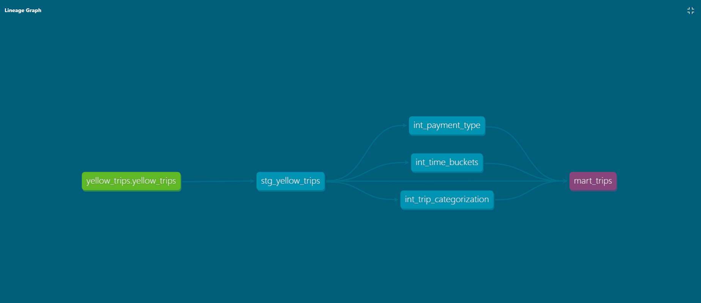

# Project Overview

This project is the transformation layer of a multi-stage data pipeline built on the NYC Taxi public dataset. Sitting directly downstream of etl-nyc-taxi-pipeline, it uses dbt to apply structured SQL transformations across three model layers: staging, intermediate, and mart. The result is a clean, analytics-ready dataset that serves as the foundation for exploratory analysis of taxi fare patterns, trip characteristics, and tipping behavior.

# Tech Stack

- dbt Core 1.11.8 — transformation framework used to transition a cleaned dataset into an analytics-ready dataset.
- BigQuery — data warehouse where models are materialized. Houses the data and models.
- dbt-utils — dbt package used for surrogate key generation (`generate_surrogate_key`). A surrogate key was needed due to the absence of a useable primary key.
- Python / pip — for managing the dbt environment and installing needed dependencies.
- Git / GitHub — version control

# Model Architecture

This project features a three layer pattern: staging, intermediate, and mart layers.

## Staging Layer

The staging layer mirrors the raw source table from BigQuery, applying light transformations including column selection, data type standardization, and surrogate key generation via `dbt_utils.generate_surrogate_key`.

**Models:**
- `stg_yellow_trips.sql`

## Intermediate Layer

The intermediate layer enriches each trip record with three purpose-built models: payment type labeling, time of day bucketing, and trip distance categorization.

**Models:**
- `int_payment_type.sql`
- `int_time_buckets.sql`
- `int_trip_categorization.sql`

## Mart Layer

The mart layer model joins all upstream models into a final table that can be used for analysis.

**Models:**
- `mart_trips.sql`

A lineage graph screenshot can be seen below:

# How to Run

## Prerequisites

- Clone the Repo
- install dbt Core via `pip install dbt-bigquery`
  - dbt installation can be found in the official dbt docs: https://docs.getdbt.com/
- Python 3.9+ is needed
- install python dependencies with `pip install -r requirements.txt`
- A Google Cloud project with the BigQuery API enabled
- A service account key with BigQuery permissions needs to be created
- `GOOGLE_APPLICATION_CREDENTIALS` environment variable set to your key file path
- Git should be installed for version control
- configure profiles.yml for your dbt profile. This file should include information such as the data source and connection method.
  - can be found here: ~/.dbt/profiles.yml
  
## How to run the models

- to run all models, use the command `dbt run`

- to run a specific model, use the dbt run command and specify which model (i.e. `dbt run -s mart_trips`)

## How to run the tests

- to run the tests, use `dbt test`

- to run a test on a specific model, use the dbt test command and specify which model (i.e. `dbt test -s mart_trips`)

## How to generate and view the docs

- Run the commands `dbt docs generate` and `dbt docs serve`

# Key Findings

The main focus of the analyses conducted was regarding January 2022 taxi fares and if they differed by time or day. The overall finding was that there was not much variance, however there were still some interesting findings.

- When comparing fares by days of the week, interestingly there was not a significant difference  [range: $12.15 - $13.72]. That being said, Friday and Sunday tended to trend on the higher side, while Saturday tended to trend lower, showing the disparity between seemingly similar days.
- There also was not a significant difference when comparing taxi fares by weekends vs weekdays.
- The pattern changes, however, when comparing taxi fares by time of day. Some interesting findings show that early mornings (5am - 8am) have the highest fare [$14.03], while trips during the morning rush (8 am - 11am) showed the lowest fare as well as tips. The highest average tips are found in taxi trips that are performed overnight (10 pm - 5 am).
- One last analysis, this time comparing tips by days of the week, show that Sunday is the day that sees the highest average tips [$2.55], while Wednesday sees the lowest average. 

# What is Next

- Now that the pipeline is complete, the next step is to schedule and monitor it using Apache Airflow.
- Once Airflow is added, the full process from extraction to final analysis will be fully fleshed out.
- One note on further analyses: this project currently only focuses on a small subset of data for convenience. A more complete analysis would include a much bigger sample, including more months and years. Perhaps the findings would change and produce even more interesting insights.